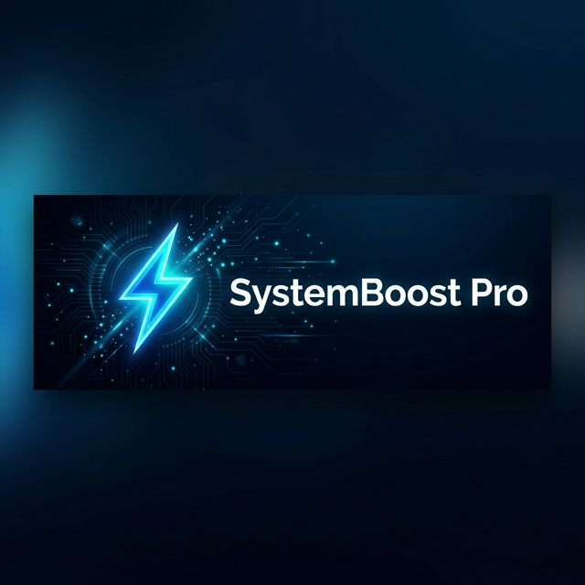

<p align="center">
  
</p>

<h1 align="center">⚡ SystemBoost Pro</h1>

<p align="center">
  <strong>A premium desktop system optimizer built with Electron</strong><br/>
  Real-time monitoring • Smart cleanup • AI recommendations • Gaming mode
</p>

<p align="center">
  
  
  
  
</p>

---

## 🚀 Overview

**SystemBoost Pro** is a feature-rich Windows system optimizer with a stunning glassmorphism UI. It provides real-time hardware monitoring, intelligent system cleanup, process management, startup optimization, and AI-powered recommendations — all wrapped in a beautiful, responsive Electron application.

---

## ✨ Features

### 📊 Real-Time Dashboard
- **CPU Monitoring** — Live usage percentage, per-core breakdown, model & speed info
- **RAM Monitoring** — Used/free/total memory with real-time usage graphs
- **Disk Monitoring** — Per-drive usage, capacity, and available space
- **Network Monitoring** — Upload/download speeds with live throughput tracking
- **System Health Score** — An intelligent composite score based on overall system state
- **Battery Tracking** — Charge level, charging status, and battery health

### 🧹 Smart Cleanup
- Scans and removes **temporary files**, **system cache**, and **junk data**
- Category-based scanning (Temp Files, System Cache, Logs, Recycle Bin, etc.)
- Preview scanned files before cleaning
- Displays total space recovered after cleanup

### ⚙️ Process Manager
- View all running processes with **CPU & memory usage**
- Identify and kill **unresponsive** or **resource-hogging** processes
- Detect and terminate **bloatware / non-essential** background apps
- Sort and filter processes for quick management

### 🚀 Startup Manager
- View all **startup programs** with impact analysis
- Enable/disable startup entries to **speed up boot time**
- Categorize programs by startup impact (High / Medium / Low)

### 🧠 AI Recommendations Engine
- Analyzes **RAM, CPU, disk, processes, and battery** state
- Generates prioritized optimization suggestions (Critical → Warning → Info)
- One-click actionable recommendations (Optimize RAM, Run Cleanup, etc.)
- Context-aware advice based on system configuration

### 🎮 Gaming Mode
- Redirects system resources for **maximum performance**
- Toggle directly from the sidebar for instant activation
- Reduces background task interference during gaming sessions

### 📅 Auto-Optimization Scheduler
- Schedule **daily or weekly** automated optimizations
- Configurable tasks: Cleanup, RAM Optimize, Kill Bloat
- Runs silently in the background at the scheduled time
- Manual "Run Now" option for on-demand optimization

### 📝 Activity Logs
- Comprehensive logging of all optimization actions
- Filter logs by type (Info, Warning, Error, Success)
- Timestamped entries for easy troubleshooting

### 🎨 Premium UI/UX
- **Glassmorphism** design with frosted-glass cards and subtle blur effects
- **Dark & Light themes** with smooth toggle transition
- **Inter font** from Google Fonts for clean, modern typography
- **Chart.js** powered real-time graphs and visualizations
- Custom frameless window with branded title bar
- Smooth page transitions and micro-animations
- Toast notifications and confirmation modals

---

## 🏗️ Architecture

```
systemboost-pro/
├── assets/
│   ├── banner.png
│   └── icon.svg
├── src/
│   ├── main/                        # Electron Main Process
│   │   ├── main.js                  # App entry point & IPC handlers
│   │   ├── preload.js               # Secure bridge between main & renderer
│   │   └── services/
│   │       ├── monitor.js           # CPU, RAM, Disk, Network monitoring
│   │       ├── cleaner.js           # Temp file & cache cleanup
│   │       ├── healthScore.js       # System health score calculator
│   │       ├── batteryService.js    # Battery monitoring
│   │       ├── ramOptimizer.js      # RAM optimization
│   │       ├── processManager.js    # Process listing & management
│   │       ├── startupManager.js    # Startup program control
│   │       ├── recommendations.js   # AI recommendation engine
│   │       ├── scheduler.js         # Auto-optimization scheduler
│   │       └── logger.js            # Activity logging system
│   └── renderer/                    # Electron Renderer Process
│       ├── index.html               # Main app shell
│       ├── js/
│       │   ├── app.js               # Page router & navigation
│       │   ├── components/
│       │   │   ├── charts.js        # Chart.js graph components
│       │   │   └── notifications.js # Toast notification system
│       │   └── pages/
│       │       ├── dashboard.js     # Dashboard page
│       │       ├── cleanup.js       # Cleanup page
│       │       ├── processes.js     # Process manager page
│       │       ├── startup.js       # Startup manager page
│       │       ├── logs.js          # Activity logs page
│       │       └── settings.js      # Settings page
│       └── styles/
│           ├── main.css             # Core design system & variables
│           ├── components.css       # UI component styles
│           └── charts.css           # Chart & graph styles
├── package.json
└── .gitignore
```

---

## 🛠️ Tech Stack

| Technology | Purpose |
|------------|---------|
| **Electron 28** | Cross-platform desktop framework |
| **Chart.js 4** | Real-time data visualization |
| **systeminformation** | Hardware & OS data collection |
| **Vanilla JS** | Lightweight, fast renderer |
| **CSS3** | Glassmorphism, animations, theming |
| **electron-builder** | Packaging & distribution |

---

## 📦 Getting Started

### Prerequisites
- **Node.js** 18+ and **npm** installed
- **Windows** OS (optimized for Windows APIs)

### Installation

```bash
# Clone the repository
git clone https://github.com/shwet/systemboost-pro.git
cd systemboost-pro

# Install dependencies
npm install

# Run in development mode
npm run dev

# Or run normally
npm start
```

### Build for Production

```bash
# Package as Windows installer (.exe)
npm run build
```

The installer will be generated in the `dist/` folder.

---

## ⌨️ Scripts

| Script | Description |
|--------|-------------|
| `npm start` | Launch the app |
| `npm run dev` | Launch in development mode |
| `npm run package` | Package for Windows |
| `npm run build` | Build Windows installer |

---

## 📄 License

This project is licensed under the **MIT License** — see the [LICENSE](LICENSE) file for details.

---

<p align="center">
  Made with ❤️ and ⚡ by <strong>SystemBoost Pro</strong>
</p>
